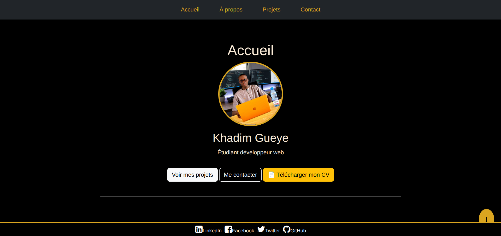
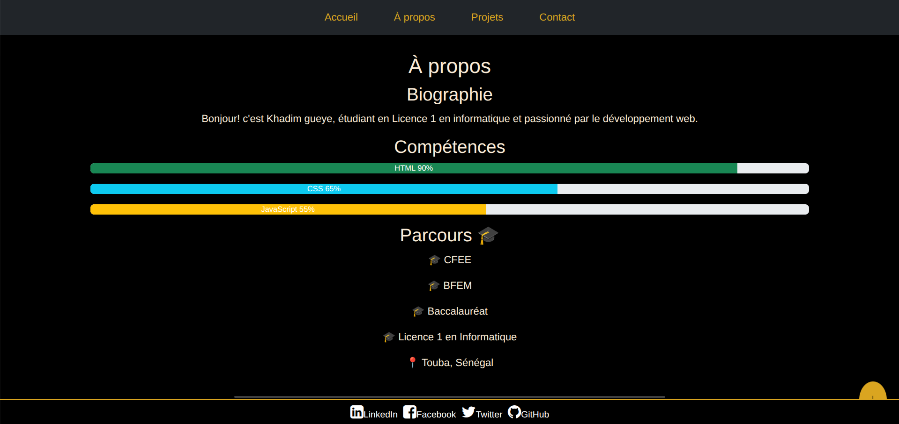
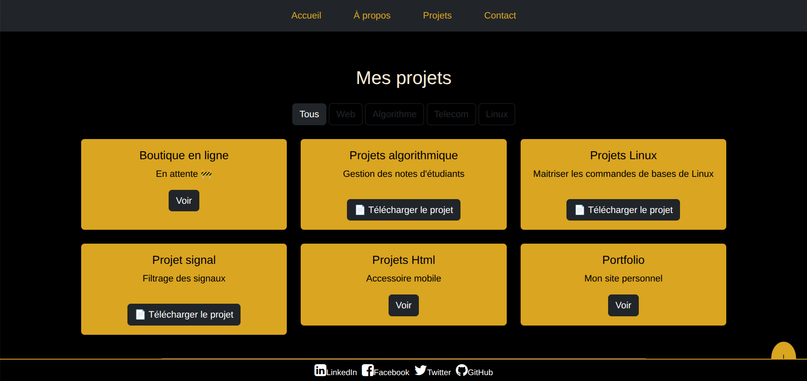
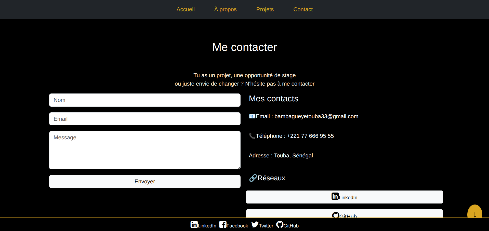

# mon-projet

Site web responsive développé pour présenter mon portfolio personnel.

---

## Sujet choisi

- Sujet B — Portfolio 

---

## Technologies utilisées
- HTML5  
- CSS3  
- Bootstrap 5  
- JavaScript (Vanilla)

---

## Site en ligne
👉 https://chiehouna59-cmyk.github.io/mon-projet/

---

## Fonctionnalités
- Navbar responsive 
- Carousel de présentation  
- Formulaire de contact avec validation   
- Filtre dynamique 

---

## Captures d'écran

### Accueil

### A-propos

### Projets

### Contact

---

## Équipe
- khadim gueye  
- modou fall
- boydo sow  

---

## 🙏 Remerciements
Projet réalisé dans le cadre du module **Développement Web**.
